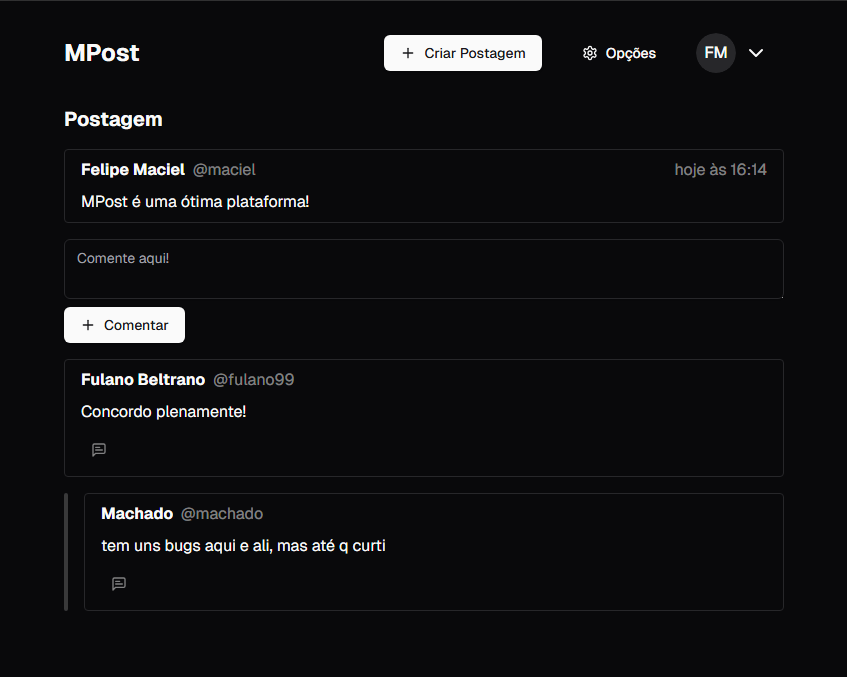

# MPost

    
O MPost é um projeto de rede social feita com Next.js, onde usuários podem criar postagens e interagir uns com os outros.

    

Altamente inspirado pelo X (antigo Twitter), trata-se de um "sucessor espiritual" a um projeto anterior meu, o [MBlog](https://github.com/m4c1elz/mblog-web), que havia como intuito me ajudar a aprender novas funcionalidades como autenticação e autorização com JWT, verificação de e-mail, entre outros.

Algumas das funcionalidades que o projeto inclui:

-   Verificação de E-mail
-   Autorização e Autenticação com Next-Auth
-   Extensivo uso de Server Actions e funcionalidades do App Router (Next.js 15)
-   Notificações ao comentar em postagens e responder comentários
-   Validação de dados em formulários com Zod
-   Tema Claro/Noturno
-   Interface feita com Shadcn/ui
-   Criação, Leitura, Edição e Remoção de novas postagens dos usuários
-   Criação, Leitura, Edição e Remoção do usuário registrado na sessão atual
