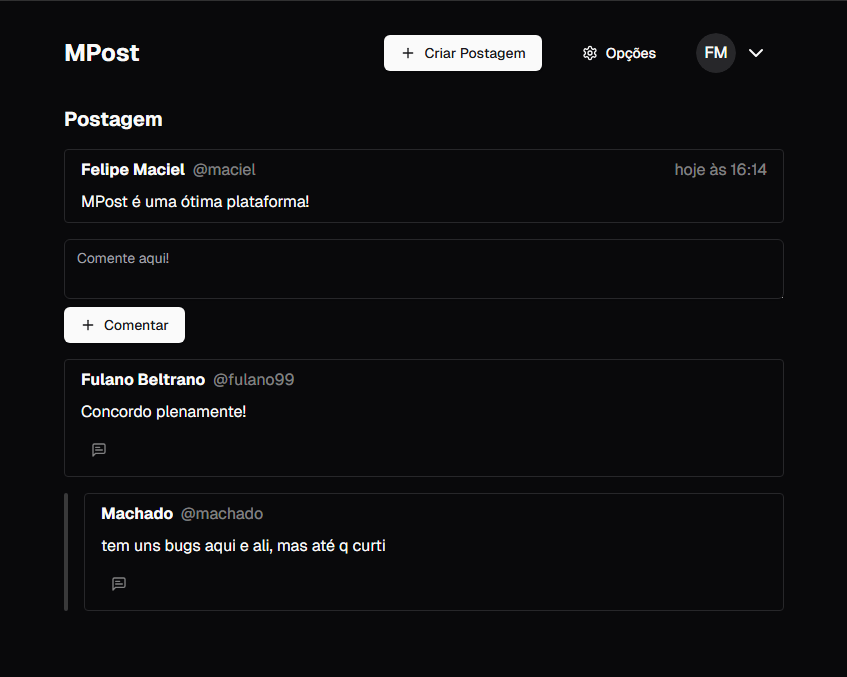

# MPost

<center>
    <p><a href="https://mpost.maciel.app">MPost</a> is a simple social media app made with Next.js.</p>
    
</center>

Inspired by X (Twiiter)'s UI, MPost is just a simple social media app where you can post and comment on other people's posts. This is a non-profit project maintained purely for fun.

### Building locally

Requirements:

- Node.js (v18+)
- PNPM
- Docker (optional, used for local database)

Clone the repo and install the dependencies:

```sh
git clone https://github.com/m4c1elz/mpost
cd mpost
pnpm install
```

If you're going to use the docker-compose.yaml database, run the following:

```sh
pnpm db:up
```

(Make sure to create a .env file with the database URL.)

Run the following commands to apply migrations:

```sh
pnpm db:migrate
pnpm db:generate # generating prisma client, mpost uses prisma v6
pnpm db:seed # adding fake data to the db
```

Once that's done, you can set up the development server:

```sh
pnpm dev
```
